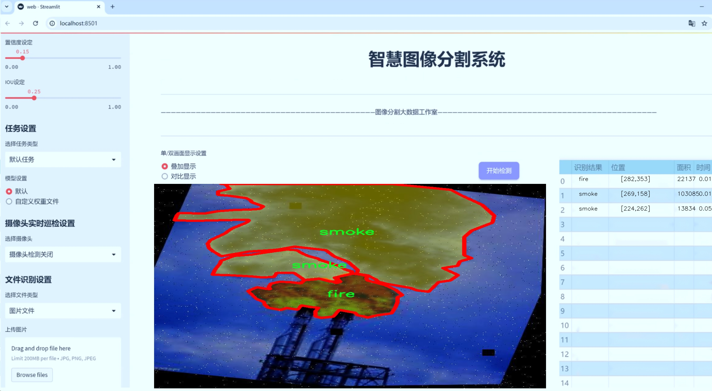
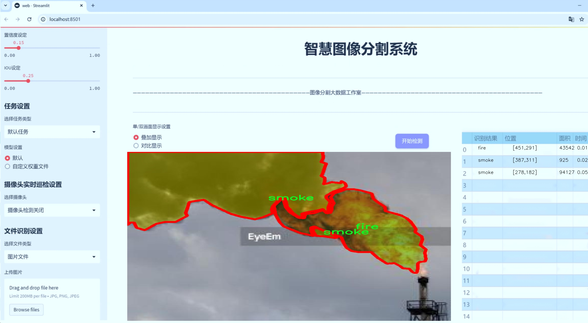
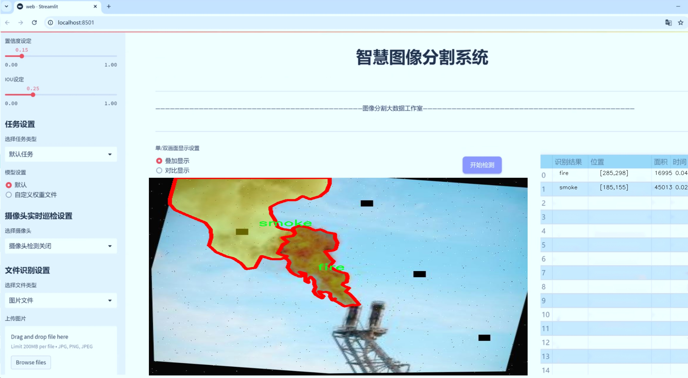
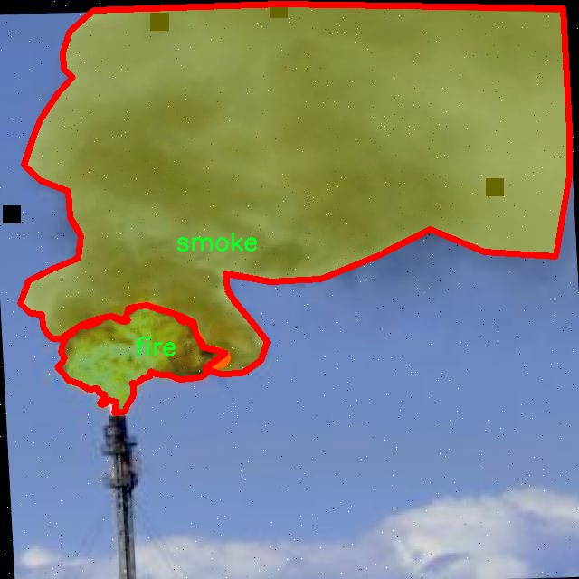
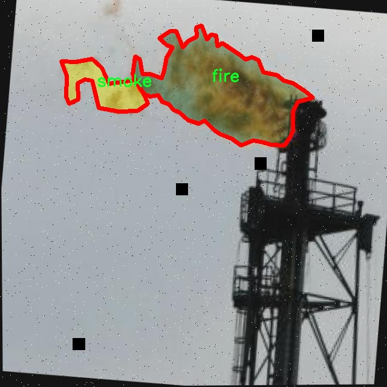
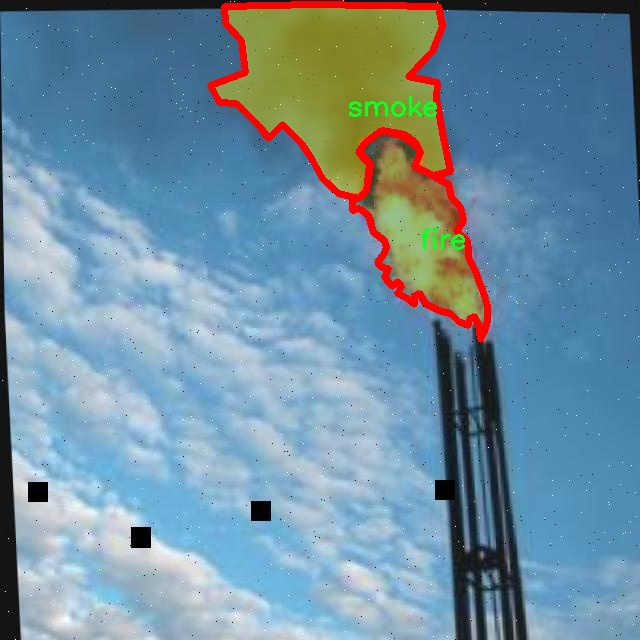
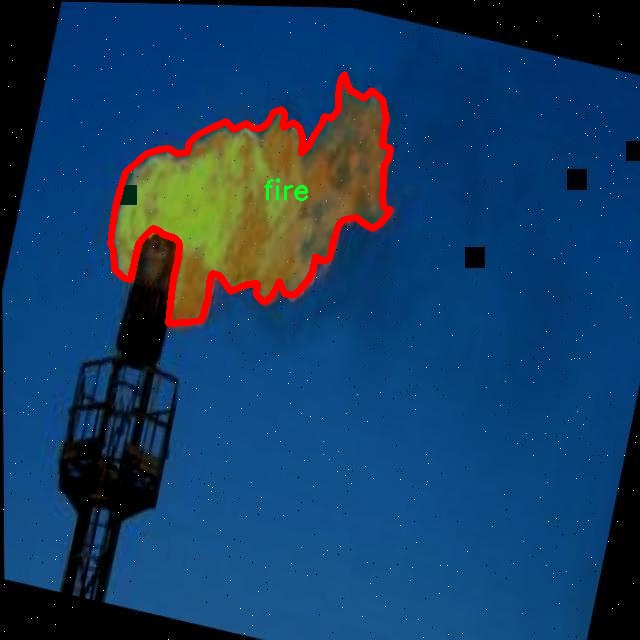

# 化工厂火灾烟雾图像分割系统： yolov8-seg-C2f-REPVGGOREPA

### 1.研究背景与意义

[参考博客](https://gitee.com/YOLOv8_YOLOv11_Segmentation_Studio/projects)

[博客来源](https://kdocs.cn/l/cszuIiCKVNis)

研究背景与意义

随着工业化进程的加快，化工厂作为重要的生产基地，其安全问题日益受到重视。火灾作为化工厂中最常见且最具破坏性的事故之一，常常导致严重的财产损失和人员伤亡。因此，开发高效的火灾监测与预警系统显得尤为重要。传统的火灾监测方法多依赖于人工巡检和简单的火灾探测器，存在反应速度慢、准确性低等缺陷，难以满足现代化工厂对安全管理的高要求。近年来，计算机视觉技术的迅猛发展为火灾监测提供了新的解决方案，尤其是基于深度学习的图像分割技术在火灾检测中的应用，展现出了良好的前景。

在众多深度学习模型中，YOLO（You Only Look Once）系列因其高效的实时检测能力而备受关注。YOLOv8作为该系列的最新版本，结合了更为先进的网络结构和优化算法，能够在保证检测精度的同时，实现更快的推理速度。然而，现有的YOLOv8模型在处理复杂场景下的火灾和烟雾图像时，仍然面临着一些挑战，如对小目标的检测能力不足、背景干扰的影响等。因此，针对化工厂火灾烟雾图像的特征，改进YOLOv8模型以提升其在实例分割任务中的表现，具有重要的研究意义。

本研究将基于FMMK2数据集，该数据集包含1000幅图像，涵盖了火灾和烟雾两个类别。通过对该数据集的深入分析，我们可以提取出火灾和烟雾在图像中的特征信息，进而为改进YOLOv8模型提供数据支持。火灾和烟雾的图像分割不仅能够帮助系统更准确地识别火灾发生的区域，还能为后续的火灾响应和救援工作提供重要依据。通过实现对火灾和烟雾的精准分割，我们能够有效降低误报率，提高火灾监测系统的可靠性。

此外，改进后的YOLOv8模型在化工厂火灾烟雾图像分割中的应用，能够为相关领域的研究提供借鉴。随着数据集的不断丰富和模型的不断优化，未来有望在更多复杂场景下实现高效的火灾监测与预警。通过与物联网技术的结合，火灾监测系统可以实现实时数据传输和分析，进一步提升化工厂的安全管理水平。

综上所述，基于改进YOLOv8的化工厂火灾烟雾图像分割系统的研究，不仅具有重要的理论价值，还有助于推动火灾监测技术的进步，提升化工厂的安全保障能力。随着研究的深入，期望能够为实现更智能化的安全管理体系贡献力量，为化工行业的可持续发展提供有力支持。

### 2.图片演示







注意：本项目提供完整的训练源码数据集和训练教程,由于此博客编辑较早,暂不提供权重文件（best.pt）,需要按照6.训练教程进行训练后实现上图效果。

### 3.视频演示

[3.1 视频演示](https://www.bilibili.com/video/BV1SQm2Y6EHW/)

### 4.数据集信息

##### 4.1 数据集类别数＆类别名

nc: 2
names: ['fire', 'smoke']


##### 4.2 数据集信息简介

数据集信息展示

在化工厂火灾烟雾图像分割系统的研究中，FMMK2数据集作为核心资源，扮演着至关重要的角色。该数据集专门为训练和改进YOLOv8-seg模型而设计，旨在提高火灾和烟雾的检测与分割精度，以便于在实际应用中实现更高效的安全监测和应急响应。FMMK2数据集包含两类主要目标，分别是“火焰”和“烟雾”，这两类目标在化工厂的火灾场景中极为常见，且具有显著的视觉特征差异。

数据集的构建过程经过精心设计，确保了数据的多样性和代表性。FMMK2数据集的图像来源于不同类型的化工厂环境，涵盖了多种火灾发生的场景，包括但不限于设备故障、化学反应失控和意外泄漏等。这些图像不仅包括不同时间段拍摄的火灾和烟雾场景，还涵盖了各种天气条件和光照环境下的情况，确保模型在实际应用中具备良好的适应性和鲁棒性。

在FMMK2数据集中，火焰和烟雾的标注采用了高精度的分割掩码，确保每个目标的边界清晰可辨。这种精细的标注方式使得YOLOv8-seg模型能够学习到更为准确的特征，从而在图像分割任务中表现出色。火焰的标注通常呈现出鲜艳的橙色和红色，具有较高的亮度和对比度，而烟雾则以灰色和白色为主，呈现出较为模糊的边界。这种视觉上的差异为模型的训练提供了丰富的特征信息，帮助其在复杂场景中有效区分这两类目标。

此外，FMMK2数据集还注重数据的平衡性和代表性，确保每类目标的样本数量相对均衡，以避免模型在训练过程中出现偏倚现象。通过对不同场景和条件下的火焰与烟雾进行充分采集和标注，FMMK2数据集为YOLOv8-seg模型的训练提供了坚实的基础，提升了模型在真实环境中检测和分割火灾烟雾的能力。

在实际应用中，FMMK2数据集的价值不仅体现在模型训练阶段，更在于其为后续的火灾监测和安全预警系统提供了可靠的数据支持。通过对火灾和烟雾的精准分割，相关系统能够实时识别潜在的危险，及时发出警报，从而有效降低火灾带来的损失和风险。

总之，FMMK2数据集以其丰富的图像样本、精细的标注和多样的场景，为改进YOLOv8-seg的化工厂火灾烟雾图像分割系统提供了重要的支持。通过充分利用这一数据集，研究人员能够在火灾监测领域取得更为显著的进展，为化工厂的安全管理和应急响应提供有力保障。










### 5.项目依赖环境部署教程（零基础手把手教学）

[5.1 环境部署教程链接（零基础手把手教学）](https://www.bilibili.com/video/BV1jG4Ve4E9t/?vd_source=bc9aec86d164b67a7004b996143742dc)


[5.2 安装Python虚拟环境创建和依赖库安装视频教程链接（零基础手把手教学）](https://www.bilibili.com/video/BV1nA4VeYEze/?vd_source=bc9aec86d164b67a7004b996143742dc)

### 6.手把手YOLOV8-seg训练视频教程（零基础手把手教学）

[6.1 手把手YOLOV8-seg训练视频教程（零基础小白有手就能学会）](https://www.bilibili.com/video/BV1cA4VeYETe/?vd_source=bc9aec86d164b67a7004b996143742dc)


按照上面的训练视频教程链接加载项目提供的数据集，运行train.py即可开始训练



     Epoch   gpu_mem       box       obj       cls    labels  img_size
     1/200     0G   0.01576   0.01955  0.007536        22      1280: 100%|██████████| 849/849 [14:42<00:00,  1.04s/it]
               Class     Images     Labels          P          R     mAP@.5 mAP@.5:.95: 100%|██████████| 213/213 [01:14<00:00,  2.87it/s]
                 all       3395      17314      0.994      0.957      0.0957      0.0843

     Epoch   gpu_mem       box       obj       cls    labels  img_size
     2/200     0G   0.01578   0.01923  0.007006        22      1280: 100%|██████████| 849/849 [14:44<00:00,  1.04s/it]
               Class     Images     Labels          P          R     mAP@.5 mAP@.5:.95: 100%|██████████| 213/213 [01:12<00:00,  2.95it/s]
                 all       3395      17314      0.996      0.956      0.0957      0.0845

     Epoch   gpu_mem       box       obj       cls    labels  img_size
     3/200     0G   0.01561    0.0191  0.006895        27      1280: 100%|██████████| 849/849 [10:56<00:00,  1.29it/s]
               Class     Images     Labels          P          R     mAP@.5 mAP@.5:.95: 100%|███████   | 187/213 [00:52<00:00,  4.04it/s]
                 all       3395      17314      0.996      0.957      0.0957      0.0845


### 7.50+种全套YOLOV8-seg创新点加载调参实验视频教程（一键加载写好的改进模型的配置文件）

[7.1 50+种全套YOLOV8-seg创新点加载调参实验视频教程（一键加载写好的改进模型的配置文件）](https://www.bilibili.com/video/BV1Hw4VePEXv/?vd_source=bc9aec86d164b67a7004b996143742dc)

### YOLOV8-seg算法简介

原始YOLOV8-seg算法原理

YOLOv8-seg算法是Ultralytics在2023年推出的最新一代目标检测与分割模型，作为YOLO系列的延续，它在设计上融合了前几代YOLO模型的优点，特别是YOLOX、YOLOv6、YOLOv7和PP-YOLOE等算法的创新思想。YOLOv8-seg不仅在目标检测上表现出色，同时也在图像分割任务中展现了强大的能力，使其成为计算机视觉领域中的一项重要进展。

YOLOv8-seg的核心架构采用了C2f模块，这一模块的引入是为了替代YOLOv5中的C3模块，旨在提升特征提取的效率和准确性。C2f模块通过分离卷积操作和特征连接，优化了特征流动，使得模型在处理复杂场景时能够更好地捕捉到细节信息。此外，YOLOv8-seg的主干网络采用了CSP（Cross Stage Partial）结构，这种结构的设计理念是将特征提取过程分为两个部分，分别进行卷积和连接，从而提高了网络的表达能力和计算效率。

在特征融合方面，YOLOv8-seg引入了PAN-FPN（Path Aggregation Network - Feature Pyramid Network）结构。该结构通过多尺度特征的融合，能够有效地提升模型对不同尺度目标的检测能力。这一设计使得YOLOv8-seg在处理具有不同尺寸和形状的目标时，能够保持较高的检测精度和速度。此外，YOLOv8-seg采用了Anchor-Free的检测方式，这一创新减少了对先验框的依赖，使得模型在训练和推理过程中更加灵活。

YOLOv8-seg的Detect模块使用了解耦头结构，这一结构的优势在于它能够将目标的分类和回归任务分开处理，从而提高了模型的整体性能。通过解耦头结构，YOLOv8-seg能够更好地应对复杂场景下的目标检测和分割任务，尤其是在存在遮挡和重叠的情况下，模型依然能够保持较高的准确性。

在损失函数的设计上，YOLOv8-seg采用了CloU（Class-aware Localization Uncertainty）损失函数，这一损失函数通过考虑目标的类别信息，能够更好地引导模型进行精确的目标定位和分类。CloU损失函数的引入使得YOLOv8-seg在训练过程中能够有效地降低定位误差，从而提升模型的整体性能。

值得一提的是，YOLOv8-seg在实时检测方面的表现尤为突出。通过SPPF（Spatial Pyramid Pooling Fast）模块的引入，YOLOv8-seg能够在保持高精度的同时，显著提高模型的计算速度。这一模块通过对特征图进行多尺度池化，增强了模型对不同尺寸目标的适应能力，使得YOLOv8-seg在实际应用中能够实现快速响应。

YOLOv8-seg的应用场景广泛，尤其在农业领域表现出色。例如，在苹果采摘的应用中，YOLOv8-seg能够利用其强大的视觉识别能力，自动检测和定位苹果，为自动采摘机器人提供精准的目标信息。通过与蚁群算法结合，YOLOv8-seg不仅能够实现目标的快速识别，还能够为机器人规划最优路径，从而提高采摘效率。

综上所述，YOLOv8-seg算法在目标检测与分割领域的创新设计，使其成为一种高效、准确且灵活的解决方案。通过引入C2f模块、PAN-FPN结构、Anchor-Free检测方式以及CloU损失函数，YOLOv8-seg在多个方面进行了优化，充分展现了其在复杂场景下的强大能力。随着YOLOv8-seg的不断发展与应用，预计将为计算机视觉领域带来更多的创新与突破。


### 9.系统功能展示（检测对象为举例，实际内容以本项目数据集为准）

图9.1.系统支持检测结果表格显示

  图9.2.系统支持置信度和IOU阈值手动调节

  图9.3.系统支持自定义加载权重文件best.pt(需要你通过步骤5中训练获得)

  图9.4.系统支持摄像头实时识别

  图9.5.系统支持图片识别

  图9.6.系统支持视频识别

  图9.7.系统支持识别结果文件自动保存

  图9.8.系统支持Excel导出检测结果数据


### 10.50+种全套YOLOV8-seg创新点原理讲解（非科班也可以轻松写刊发刊，V11版本正在科研待更新）

#### 10.1 由于篇幅限制，每个创新点的具体原理讲解就不一一展开，具体见下列网址中的创新点对应子项目的技术原理博客网址【Blog】：


[10.1 50+种全套YOLOV8-seg创新点原理讲解链接](https://gitee.com/qunmasj/good)

#### 10.2 部分改进模块原理讲解(完整的改进原理见上图和技术博客链接)【如果此小节的图加载失败可以通过CSDN或者Github搜索该博客的标题访问原始博客，原始博客图片显示正常】
### YOLOv8模型原理

YOLOv8是YOLO系列最新的模型,具有非常优秀的检测精度和速度。根据网络的深度与特征图的宽度大小, YOLOv8算法分为:YOLOv8-n、YOLOv8一s 、YOLOv8-m 、 YOLOv8-l、和 YOLOv8-x 5个版本。按照网络结构图,YOLOv8可分为: Inpul 、 Backbone , Neck和Head 4部分。


Backbone采用了CSPDarknet 架构，由CBS (标准卷积层)、C2f模块和 SPPF(金字塔池化）组成。通过5次标准卷积层和C2f模块逐步提取图像特征，并在网络末尾添加SPPF模块，将任意大小的输入图像转换成固定大小的特征向量。分别取P3、P4、P5层的特征提取结果，向Head输出80×80、40 × 40、20×20三个尺度的特征层。
C2f模块借鉴了残差网络(ResNet)以及ELAN的思想，其结构分为两个分支，主干部分利用Bottleneckm2%模块逐步加深网络，分支部分保留输入层通道并与主干部分特征进行融合，如图所示。通过标准卷积层提取新的特征层，相比于YOLOv5使用的C3模块，C2f模块可以在卷积层和全连接层之间建立一个平滑的转换，从而实现了参数的共享，提高了模型的效率和泛化能力。
Head采用了PAN-FPN 结构,将 Backbone输入的3个特征层进行多尺度融合，进行自顶向下(FAN)和自底向上 (PAN)的特征传递，对金字塔进行增强，使不同尺寸的特征图都包含强目标语义信息和强目标特征信息，保证了对不同尺寸样本的准确预测。
Detect借鉴了Decoupled-Head 思想，用一个解耦检测头将输入的不同尺寸特征层分成2个分支进行检测。第1个分支在进行3次卷积后使进行回归任务，输出预测框。第2个分支在进行3次卷积后进行分类任务，输出类别的概率。采用Varifocal_Loss2”作为损失函数，其式为:


### Context_Grided_Network(CGNet)简介
参考该博客提出的一种轻量化语义分割模型Context Grided Network(CGNet)，以满足设备的运行需要。

CGNet主要由CG块构建而成，CG块可以学习局部特征和周围环境上下文的联合特征，最后通过引入全局上下文特征进一步改善联合特征的学习。


 
下图给出了在Cityscapes数据集上对现有的一些语义分割模型的测试效果，横轴表示参数量，纵轴表示准确率(mIoU)。可以看出，在参数量较少的情况下，CGNet可以达到一个比较好的准确率。虽与高精度模型相去甚远，但在一些对精度要求不高、对实时性要求比较苛刻的情况下，很有价值。


高精度模型，如DeepLab、DFN、DenseASPP等，动不动就是几十M的参数，很难应用在移动设备上。而上图中红色的模型，相对内存占用较小，但它们的分割精度却不是很高。作者认为主要原因是，这些小网络大多遵循着分类网络的设计思路，并没有考虑语义分割任务更深层次的特点。

空间依赖性和上下文信息对提高分割精度有很大的作用。作者从该角度出发，提出了CG block，并进一步搭建了轻量级语义分割网络CGNet。CG块具有以下特点： 

学习局部特征和上下文特征的联合特征；
通过全局上下文特征改进上述联合特征；
可以贯穿应用在整个网络中，从low level（空间级别）到high level（语义级别）。不像PSPNet、DFN、DenseASPP等，只在编码阶段以后捕捉上下文特征。；
只有3个下采样，相比一般5个下采样的网络，能够更好地保留边缘信息。
CGNet遵循“深而薄”的原则设计，整个网络又51层构成。其中，为了降低计算，大量使用了channel-wise conv.

小型语义分割模型：

需要平衡准确率和系统开销
进化路线：ENet -> ICNet -> ESPNet
这些模型基本都基于分类网络设计，在分割准确率上效果并不是很好
上下文信息模型：

大多数现有模型只考虑解码阶段的上下文信息并且没有利用周围的上下文信息
注意力机制：

CG block使用全局上下文信息计算权重向量，并使用其细化局部特征和周围上下文特征的联合特征

#### Context Guided Block
CG block由4部分组成：


此外，CG block还采用了残差学习。文中提出了局部残差学习（LRL）和全局残差学习（GRL）两种方式。 LRL添加了从输入到联合特征提取器的连接，GRL添加了从输入到全局特征提取器的连接。从直观上来说，GRL比LRL更能促进网络中的信息传递（更像ResNet~~），后面实验部分也进行了测试，的确GRL更能提升分割精度。


CGNet的通用网络结构如下图所示，分为3个stage，第一个stage使用3个卷积层抽取特征，第二和第三个stage堆叠一定数量的CG block，具体个数可以根据情况调整。最后，通过1x1 conv得到分割结果。


下图是用于Cityscapes数据集的CGNet网络细节说明：输入尺寸为3*680*680；stage1连续使用了3个Conv-BN-PReLU组合，首个组合使用了stride=2的卷积，所以得到了1/2分辨率的feature map；stage2和stage3分别使用了多个CG block，且其中使用了不同大小的膨胀卷积核，最终分别得到了1/4和1/8的feature map。

需注意：

stage2&3的输入特征分别由其上一个stage的首个和最后一个block组合给出（参考上图的绿色箭头）；

输入注入机制，图中未体现，实际使用中，作者还将输入图像下采样1/4或1/8，分别给到stage2和stage3的输入中 ，以进一步加强特征传递。

channel-wise conv。为了缩减参数数量，在局部特征提取器和周围上下文特征提取器中使用了channel-wise卷积，可以消除跨通道的计算成本，同时节省内存占用。但是，没有像MobileNet等模型一样，在depth-wise卷积后面接point-wise卷积（1*1 conv），作者解释是，因为CG block需要保持局部特征和周围上下文特征的独立性，而1*1 conv会破坏这种独立性，所以效果欠佳，实验部分也进行了验证。

个人感觉此处应该指的是depth-wise卷积？

官方Git中对该部分的实现如下：


### 11.项目核心源码讲解（再也不用担心看不懂代码逻辑）

#### 11.1 utils.py

以下是代码的核心部分，并附上详细的中文注释：

```python
import os
import cv2
import pandas as pd
import streamlit as st
from PIL import Image
from QtFusion.path import abs_path

def save_uploaded_file(uploaded_file):
    """
    保存上传的文件到服务器上。

    Args:
        uploaded_file (UploadedFile): 通过Streamlit上传的文件。

    Returns:
        str: 保存文件的完整路径，如果没有文件上传则返回 None。
    """
    # 检查是否有文件上传
    if uploaded_file is not None:
        base_path = "tempDir"  # 定义文件保存的基本路径

        # 如果路径不存在，创建这个路径
        if not os.path.exists(base_path):
            os.makedirs(base_path)
        
        # 获取文件的完整路径
        file_path = os.path.join(base_path, uploaded_file.name)

        # 以二进制写模式打开文件
        with open(file_path, "wb") as f:
            f.write(uploaded_file.getbuffer())  # 写入文件内容

        return file_path  # 返回文件路径

    return None  # 如果没有文件上传，返回 None


def concat_results(result, location, confidence, time):
    """
    显示检测结果。

    Args:
        result (str): 检测结果。
        location (str): 检测位置。
        confidence (str): 置信度。
        time (str): 检测用时。

    Returns:
        DataFrame: 包含检测结果的 DataFrame。
    """
    # 创建一个包含这些信息的 DataFrame
    result_data = {
        "识别结果": [result],
        "位置": [location],
        "置信度": [confidence],
        "用时": [time]
    }

    results_df = pd.DataFrame(result_data)  # 将结果数据转换为 DataFrame
    return results_df  # 返回结果 DataFrame


def get_camera_names():
    """
    获取可用摄像头名称列表。

    Returns:
        list: 返回包含“未启用摄像头”和可用摄像头索引号的列表。
    """
    camera_names = ["摄像头检测关闭", "0"]  # 初始化摄像头名称列表
    max_test_cameras = 10  # 定义要测试的最大摄像头数量

    # 测试可用的摄像头
    for i in range(max_test_cameras):
        cap = cv2.VideoCapture(i, cv2.CAP_DSHOW)  # 尝试打开摄像头
        if cap.isOpened() and str(i) not in camera_names:  # 检查摄像头是否打开
            camera_names.append(str(i))  # 将可用摄像头添加到列表
            cap.release()  # 释放摄像头资源

    if len(camera_names) == 1:
        st.write("未找到可用的摄像头")  # 如果没有找到可用摄像头，输出提示信息

    return camera_names  # 返回摄像头名称列表
```

### 代码分析：
1. **`save_uploaded_file` 函数**：用于保存用户上传的文件。首先检查是否有文件上传，如果有，则创建一个保存目录并将文件以二进制形式写入该目录。最后返回文件的完整路径。

2. **`concat_results` 函数**：用于将检测结果、位置、置信度和用时信息整理成一个 Pandas DataFrame，以便后续展示或处理。

3. **`get_camera_names` 函数**：用于检测可用的摄像头。通过尝试打开多个摄像头（最多10个），将可用的摄像头索引添加到列表中，并返回该列表。如果没有找到可用的摄像头，则会在 Streamlit 界面上输出提示信息。

这些函数是该工程的核心部分，负责文件上传、结果展示和摄像头检测等功能。

这个 `utils.py` 文件包含了一些实用的函数，主要用于处理文件上传、显示检测结果、加载默认图片以及获取可用摄像头的名称。首先，文件中导入了一些必要的库，包括 `os`、`cv2`、`pandas`、`streamlit`、`PIL` 和 `QtFusion.path`。

在文件的开头，定义了一个 `save_uploaded_file` 函数，用于保存用户通过 Streamlit 上传的文件。该函数首先检查是否有文件被上传，如果有，则定义一个基本路径 `tempDir` 用于存储文件。如果该路径不存在，函数会创建这个路径。接着，函数获取上传文件的完整路径，并以二进制写模式打开文件，将其内容写入到指定路径中。最后，函数返回保存文件的完整路径，如果没有文件上传，则返回 `None`。

接下来是 `concat_results` 函数，它用于显示检测结果。该函数接收四个参数：检测结果、位置、置信度和检测用时。它将这些信息组织成一个字典，然后使用 `pandas` 创建一个 DataFrame，最后返回这个 DataFrame。

然后是 `load_default_image` 函数，用于加载一个默认的图片。函数通过调用 `abs_path` 获取默认图片的绝对路径，并使用 `PIL` 的 `Image.open` 方法打开该图片，返回一个图片对象。

最后，定义了 `get_camera_names` 函数，用于获取可用摄像头的名称列表。函数首先初始化一个包含“未启用摄像头”和索引“0”的列表。然后，函数通过循环测试最多 10 个摄像头的可用性。如果摄像头能够成功打开，且其索引不在列表中，则将其索引添加到列表中。循环结束后，如果列表中仍然只有一个元素，说明没有找到可用的摄像头，函数会通过 `streamlit` 输出相应的提示信息。最终，函数返回可用摄像头的名称列表。

整体来看，这个文件的功能是为一个可能涉及图像处理和摄像头操作的应用提供基础的工具函数，方便后续的开发和使用。

#### 11.2 ultralytics\models\yolo\model.py

```python
# 导入必要的模块和类
from ultralytics.engine.model import Model
from ultralytics.models import yolo  # noqa
from ultralytics.nn.tasks import ClassificationModel, DetectionModel, PoseModel, SegmentationModel

class YOLO(Model):
    """YOLO (You Only Look Once) 目标检测模型的定义。"""

    @property
    def task_map(self):
        """将任务类型映射到相应的模型、训练器、验证器和预测器类。"""
        return {
            'classify': {  # 分类任务
                'model': ClassificationModel,  # 分类模型
                'trainer': yolo.classify.ClassificationTrainer,  # 分类训练器
                'validator': yolo.classify.ClassificationValidator,  # 分类验证器
                'predictor': yolo.classify.ClassificationPredictor,  # 分类预测器
            },
            'detect': {  # 检测任务
                'model': DetectionModel,  # 检测模型
                'trainer': yolo.detect.DetectionTrainer,  # 检测训练器
                'validator': yolo.detect.DetectionValidator,  # 检测验证器
                'predictor': yolo.detect.DetectionPredictor,  # 检测预测器
            },
            'segment': {  # 分割任务
                'model': SegmentationModel,  # 分割模型
                'trainer': yolo.segment.SegmentationTrainer,  # 分割训练器
                'validator': yolo.segment.SegmentationValidator,  # 分割验证器
                'predictor': yolo.segment.SegmentationPredictor,  # 分割预测器
            },
            'pose': {  # 姿态估计任务
                'model': PoseModel,  # 姿态模型
                'trainer': yolo.pose.PoseTrainer,  # 姿态训练器
                'validator': yolo.pose.PoseValidator,  # 姿态验证器
                'predictor': yolo.pose.PosePredictor,  # 姿态预测器
            },
        }
```

### 代码核心部分及注释说明：

1. **导入模块**：
   - 从 `ultralytics.engine.model` 导入 `Model` 类，这是所有模型的基类。
   - 从 `ultralytics.models` 导入 `yolo` 模块，用于后续的任务映射。
   - 从 `ultralytics.nn.tasks` 导入各种任务模型类，包括分类、检测、分割和姿态估计。

2. **YOLO 类**：
   - 该类继承自 `Model`，表示 YOLO 目标检测模型的实现。

3. **task_map 属性**：
   - 该属性返回一个字典，将不同的任务类型（如分类、检测、分割和姿态估计）映射到相应的模型、训练器、验证器和预测器类。
   - 每个任务类型的映射包含：
     - `model`：对应的模型类。
     - `trainer`：用于训练的类。
     - `validator`：用于验证的类。
     - `predictor`：用于预测的类。

这种结构化的设计使得不同任务的处理更加清晰和模块化，便于扩展和维护。

这个程序文件定义了一个名为 `YOLO` 的类，继承自 `Model` 类，主要用于实现 YOLO（You Only Look Once）目标检测模型。文件开头的注释表明该项目遵循 AGPL-3.0 许可证。

在 `YOLO` 类中，有一个名为 `task_map` 的属性，它返回一个字典，映射了不同任务类型（如分类、检测、分割和姿态估计）到相应的模型、训练器、验证器和预测器类。这个字典的结构清晰地展示了每种任务所需的组件，使得模型在不同任务下的使用变得更加方便。

具体来说，字典中的每个键代表一个任务类型，例如 'classify'、'detect'、'segment' 和 'pose'。每个键对应的值又是一个字典，包含了以下几个部分：

- `model`：对应的模型类，例如分类任务使用 `ClassificationModel`，检测任务使用 `DetectionModel`，分割任务使用 `SegmentationModel`，姿态估计任务使用 `PoseModel`。
- `trainer`：对应的训练器类，负责模型的训练过程。
- `validator`：对应的验证器类，用于在训练过程中对模型进行验证。
- `predictor`：对应的预测器类，负责在训练完成后进行模型的预测。

通过这种结构，`YOLO` 类能够灵活地支持多种计算机视觉任务，并且可以根据具体的任务类型动态选择相应的组件。这种设计使得代码的可维护性和扩展性得到了提升。

#### 11.3 ultralytics\models\utils\__init__.py

下面是代码的核心部分，并附上详细的中文注释：

```python
# Ultralytics YOLO 🚀, AGPL-3.0 license

# 导入必要的库
import torch  # 导入PyTorch库，用于深度学习模型的构建和训练

# 定义YOLO模型类
class YOLO:
    def __init__(self, model_path):
        # 初始化YOLO模型
        self.model = torch.load(model_path)  # 加载预训练的YOLO模型

    def predict(self, image):
        # 对输入图像进行预测
        with torch.no_grad():  # 在推理时不需要计算梯度
            predictions = self.model(image)  # 使用模型对图像进行预测
        return predictions  # 返回预测结果

# 使用示例
if __name__ == "__main__":
    yolo_model = YOLO('path/to/model.pt')  # 创建YOLO模型实例并加载模型
    image = torch.zeros((1, 3, 640, 640))  # 创建一个示例图像（假设为640x640的RGB图像）
    results = yolo_model.predict(image)  # 对示例图像进行预测
    print(results)  # 打印预测结果
```

### 注释说明：
1. **导入库**：首先导入了PyTorch库，这是深度学习的基础库，用于构建和训练模型。
2. **YOLO类**：定义了一个YOLO类，包含初始化和预测方法。
   - `__init__`方法用于加载预训练的YOLO模型。
   - `predict`方法接收一张图像并使用模型进行预测，使用`torch.no_grad()`确保在推理过程中不计算梯度，从而节省内存和加快计算速度。
3. **使用示例**：在主程序中创建YOLO模型实例，加载模型，并对一张示例图像进行预测，最后打印预测结果。

该文件是Ultralytics YOLO项目的一部分，属于模型相关的工具模块。文件的开头包含了一条注释，表明该项目遵循AGPL-3.0许可证。AGPL（Affero General Public License）是一种开源许可证，允许用户自由使用、修改和分发软件，但要求在分发时也必须提供源代码。

虽然代码片段中没有具体的实现细节，但通常在`__init__.py`文件中，会包含模块的初始化代码。这个文件的存在使得Python将其所在的目录视为一个包，从而可以导入该包中的其他模块和功能。

在Ultralytics YOLO的上下文中，这个工具模块可能包含与YOLO模型相关的各种实用函数、类或配置设置，帮助用户更方便地使用和扩展YOLO模型的功能。具体的实现细节和功能则需要查看该文件的完整代码以及其他相关模块。

#### 11.4 ultralytics\nn\extra_modules\RFAConv.py

以下是经过简化和注释的核心代码部分：

```python
import torch
import torch.nn as nn
from einops import rearrange

# 定义一个自定义的激活函数 h_sigmoid
class h_sigmoid(nn.Module):
    def __init__(self, inplace=True):
        super(h_sigmoid, self).__init__()
        self.relu = nn.ReLU6(inplace=inplace)  # 使用 ReLU6 激活函数

    def forward(self, x):
        return self.relu(x + 3) / 6  # h_sigmoid 的前向传播

# 定义一个自定义的激活函数 h_swish
class h_swish(nn.Module):
    def __init__(self, inplace=True):
        super(h_swish, self).__init__()
        self.sigmoid = h_sigmoid(inplace=inplace)  # 使用 h_sigmoid

    def forward(self, x):
        return x * self.sigmoid(x)  # h_swish 的前向传播

# 定义 RFAConv 类
class RFAConv(nn.Module):
    def __init__(self, in_channel, out_channel, kernel_size, stride=1):
        super().__init__()
        self.kernel_size = kernel_size

        # 权重生成模块
        self.get_weight = nn.Sequential(
            nn.AvgPool2d(kernel_size=kernel_size, padding=kernel_size // 2, stride=stride),
            nn.Conv2d(in_channel, in_channel * (kernel_size ** 2), kernel_size=1, groups=in_channel, bias=False)
        )
        
        # 特征生成模块
        self.generate_feature = nn.Sequential(
            nn.Conv2d(in_channel, in_channel * (kernel_size ** 2), kernel_size=kernel_size, padding=kernel_size // 2, stride=stride, groups=in_channel, bias=False),
            nn.BatchNorm2d(in_channel * (kernel_size ** 2)),
            nn.ReLU()
        )
        
        # 最终卷积层
        self.conv = nn.Conv2d(in_channel, out_channel, kernel_size=kernel_size, stride=kernel_size)

    def forward(self, x):
        b, c = x.shape[0:2]  # 获取批量大小和通道数
        weight = self.get_weight(x)  # 生成权重
        h, w = weight.shape[2:]  # 获取特征图的高和宽
        
        # 对权重进行 softmax 归一化
        weighted = weight.view(b, c, self.kernel_size ** 2, h, w).softmax(2)
        feature = self.generate_feature(x).view(b, c, self.kernel_size ** 2, h, w)  # 生成特征
        
        # 加权特征
        weighted_data = feature * weighted
        conv_data = rearrange(weighted_data, 'b c (n1 n2) h w -> b c (h n1) (w n2)', n1=self.kernel_size, n2=self.kernel_size)
        
        return self.conv(conv_data)  # 返回卷积结果

# 定义 SE（Squeeze-and-Excitation）模块
class SE(nn.Module):
    def __init__(self, in_channel, ratio=16):
        super(SE, self).__init__()
        self.gap = nn.AdaptiveAvgPool2d((1, 1))  # 全局平均池化
        self.fc = nn.Sequential(
            nn.Linear(in_channel, ratio, bias=False),  # 降维
            nn.ReLU(),
            nn.Linear(ratio, in_channel, bias=False),  # 复原维度
            nn.Sigmoid()  # 激活函数
        )

    def forward(self, x):
        b, c = x.shape[0:2]
        y = self.gap(x).view(b, c)  # 通过全局平均池化获取特征
        y = self.fc(y).view(b, c, 1, 1)  # 通过全连接层
        return y  # 返回通道注意力

# 定义 RFCBAMConv 类
class RFCBAMConv(nn.Module):
    def __init__(self, in_channel, out_channel, kernel_size=3, stride=1):
        super().__init__()
        self.kernel_size = kernel_size
        
        # 特征生成模块
        self.generate = nn.Sequential(
            nn.Conv2d(in_channel, in_channel * (kernel_size ** 2), kernel_size, padding=kernel_size // 2, stride=stride, groups=in_channel, bias=False),
            nn.BatchNorm2d(in_channel * (kernel_size ** 2)),
            nn.ReLU()
        )
        
        # 权重生成模块
        self.get_weight = nn.Sequential(nn.Conv2d(2, 1, kernel_size=3, padding=1, bias=False), nn.Sigmoid())
        self.se = SE(in_channel)  # 实例化 SE 模块

        # 最终卷积层
        self.conv = nn.Conv2d(in_channel, out_channel, kernel_size=kernel_size, stride=kernel_size)

    def forward(self, x):
        b, c = x.shape[0:2]
        channel_attention = self.se(x)  # 获取通道注意力
        generate_feature = self.generate(x)  # 生成特征

        h, w = generate_feature.shape[2:]
        generate_feature = generate_feature.view(b, c, self.kernel_size ** 2, h, w)  # 重塑特征形状
        
        # 特征重排
        generate_feature = rearrange(generate_feature, 'b c (n1 n2) h w -> b c (h n1) (w n2)', n1=self.kernel_size, n2=self.kernel_size)
        
        # 加权特征
        unfold_feature = generate_feature * channel_attention
        max_feature, _ = torch.max(generate_feature, dim=1, keepdim=True)  # 最大特征
        mean_feature = torch.mean(generate_feature, dim=1, keepdim=True)  # 平均特征
        
        # 计算接收场注意力
        receptive_field_attention = self.get_weight(torch.cat((max_feature, mean_feature), dim=1))
        conv_data = unfold_feature * receptive_field_attention  # 加权特征
        return self.conv(conv_data)  # 返回卷积结果
```

### 代码说明：
1. **h_sigmoid 和 h_swish**: 自定义的激活函数，用于在网络中引入非线性。
2. **RFAConv**: 实现了一种卷积操作，结合了特征生成和权重计算，通过 softmax 归一化权重来加权特征。
3. **SE**: Squeeze-and-Excitation 模块，通过全局平均池化和全连接层来生成通道注意力。
4. **RFCBAMConv**: 结合了特征生成、通道注意力和接收场注意力的卷积模块，旨在增强特征表示能力。

这个程序文件定义了一些用于深度学习的卷积模块，主要包括RFAConv、RFCBAMConv和RFCAConv等类。这些模块的设计旨在增强卷积神经网络的特征提取能力，尤其是在处理图像数据时。

首先，文件导入了必要的库，包括PyTorch的核心库和一些辅助模块。接着，定义了两个激活函数类：h_sigmoid和h_swish。h_sigmoid是一个高阶的sigmoid函数，使用ReLU6激活，具有平滑的输出特性。h_swish则是将输入与h_sigmoid的输出相乘，形成一种新的激活函数，这在某些网络架构中表现良好。

RFAConv类是一个核心模块，旨在通过生成特征和加权特征来实现卷积操作。其构造函数中定义了多个层，包括一个用于生成权重的平均池化层和卷积层，以及一个用于生成特征的卷积层和批归一化层。在前向传播中，输入数据首先通过权重生成模块得到权重，然后通过特征生成模块得到特征，接着对特征进行加权，最后将加权后的特征重新排列并通过卷积层输出结果。

SE类实现了Squeeze-and-Excitation（SE）机制，通过全局平均池化和全连接层来生成通道注意力。这个机制可以有效地增强特征图中重要通道的表示能力，从而提高模型的性能。

RFCBAMConv类结合了RFAConv和SE机制，增加了通道注意力的计算。它在生成特征后，通过SE模块计算通道注意力，并与生成的特征进行加权。随后，通过最大池化和平均池化操作，计算出接收场注意力，并将其应用于特征图。

RFCAConv类则进一步扩展了RFCBAMConv，增加了对特征图的高度和宽度的自适应池化操作。它通过生成特征后进行池化，得到高度和宽度的特征，然后通过卷积层进行处理，最终将加权后的特征图输出。

总体而言，这个文件实现了一些复杂的卷积操作和注意力机制，旨在提高深度学习模型在图像处理任务中的表现。通过这些模块，用户可以在构建神经网络时灵活地使用不同的卷积和注意力机制，以适应特定的应用需求。

#### 11.5 ultralytics\models\nas\predict.py

以下是经过简化和注释的核心代码部分：

```python
import torch
from ultralytics.engine.predictor import BasePredictor
from ultralytics.engine.results import Results
from ultralytics.utils import ops

class NASPredictor(BasePredictor):
    """
    Ultralytics YOLO NAS 预测器，用于目标检测。

    该类扩展了 Ultralytics 引擎中的 `BasePredictor`，负责对 YOLO NAS 模型生成的原始预测结果进行后处理。
    它应用了非极大值抑制（NMS）和将边界框缩放到原始图像尺寸等操作。

    属性:
        args (Namespace): 包含各种后处理配置的命名空间。
    """

    def postprocess(self, preds_in, img, orig_imgs):
        """对预测结果进行后处理，并返回 Results 对象的列表。"""

        # 将预测结果中的边界框转换为 (x_center, y_center, width, height) 格式
        boxes = ops.xyxy2xywh(preds_in[0][0])
        
        # 将边界框和类分数合并，并调整维度
        preds = torch.cat((boxes, preds_in[0][1]), -1).permute(0, 2, 1)

        # 应用非极大值抑制，过滤掉重叠的边界框
        preds = ops.non_max_suppression(preds,
                                        self.args.conf,  # 置信度阈值
                                        self.args.iou,   # IOU 阈值
                                        agnostic=self.args.agnostic_nms,  # 是否类别无关
                                        max_det=self.args.max_det,  # 最大检测数量
                                        classes=self.args.classes)  # 选择的类别

        # 如果输入图像不是列表，则将其转换为 numpy 数组
        if not isinstance(orig_imgs, list):
            orig_imgs = ops.convert_torch2numpy_batch(orig_imgs)

        results = []
        # 遍历每个预测结果
        for i, pred in enumerate(preds):
            orig_img = orig_imgs[i]  # 获取原始图像
            # 将边界框缩放到原始图像的尺寸
            pred[:, :4] = ops.scale_boxes(img.shape[2:], pred[:, :4], orig_img.shape)
            img_path = self.batch[0][i]  # 获取图像路径
            # 创建 Results 对象并添加到结果列表
            results.append(Results(orig_img, path=img_path, names=self.model.names, boxes=pred))
        
        return results  # 返回后处理后的结果列表
```

### 代码说明：
1. **导入必要的库**：导入 PyTorch 和 Ultralytics 中的相关模块。
2. **NASPredictor 类**：该类负责处理 YOLO NAS 模型的预测结果。
3. **postprocess 方法**：这是后处理的核心方法，主要完成以下任务：
   - 将预测的边界框格式转换为 `(x_center, y_center, width, height)`。
   - 合并边界框和类分数，并进行维度调整。
   - 应用非极大值抑制（NMS）来去除重叠的边界框。
   - 将输入图像转换为 numpy 数组（如果需要）。
   - 遍历每个预测结果，缩放边界框到原始图像的尺寸，并创建 `Results` 对象，最终返回结果列表。

这个程序文件是Ultralytics YOLO NAS模型的预测器，主要用于目标检测任务。它继承自Ultralytics引擎中的`BasePredictor`类，负责对YOLO NAS模型生成的原始预测结果进行后处理。后处理的过程包括非极大值抑制（NMS）和将边界框缩放到原始图像的尺寸。

在这个类中，有一个主要的方法`postprocess`，它接收三个参数：`preds_in`（原始预测结果）、`img`（输入图像）和`orig_imgs`（原始图像）。首先，程序将预测结果中的边界框从xyxy格式转换为xywh格式，并将边界框与相应的类别分数合并。接着，使用非极大值抑制来过滤掉重叠的边界框，保留最有可能的检测结果。

在处理原始图像时，如果输入的图像不是列表格式，而是一个Torch张量，程序会将其转换为NumPy数组。然后，程序会遍历每个预测结果，缩放边界框以适应原始图像的尺寸，并将每个结果封装成`Results`对象，包含原始图像、图像路径、类别名称和边界框信息。

需要注意的是，这个类通常不会被直接实例化，而是在`NAS`类内部使用。通过这种设计，用户可以方便地调用预测器进行目标检测，并获取处理后的结果。

### 12.系统整体结构（节选）

### 程序整体功能和构架概括

该程序是一个基于YOLO（You Only Look Once）架构的目标检测系统，旨在提供高效的图像处理和目标检测功能。程序的整体结构分为多个模块，每个模块负责特定的功能，从而实现了良好的模块化设计。

1. **utils.py**：提供了一些实用工具函数，用于文件上传、结果展示、加载默认图片和获取可用摄像头的名称。
2. **model.py**：定义了YOLO模型的结构和任务映射，支持多种计算机视觉任务（如分类、检测、分割和姿态估计）。
3. **__init__.py**：作为工具模块的初始化文件，使得该目录被视为一个包，便于导入其他模块。
4. **RFAConv.py**：实现了一些增强卷积操作的模块，包括RFAConv、RFCBAMConv和RFCAConv，旨在提高特征提取能力。
5. **predict.py**：负责对YOLO NAS模型的预测结果进行后处理，包括非极大值抑制和边界框的缩放。

通过这些模块的协同工作，用户可以方便地进行目标检测任务，并在此基础上进行进一步的开发和优化。

### 文件功能整理表

| 文件路径                                         | 功能描述                                                                                  |
|--------------------------------------------------|-------------------------------------------------------------------------------------------|
| `utils.py`                                       | 提供文件上传、结果展示、加载默认图片和获取可用摄像头名称的实用工具函数。                     |
| `ultralytics/models/yolo/model.py`              | 定义YOLO模型结构，映射不同计算机视觉任务到相应的模型、训练器、验证器和预测器。               |
| `ultralytics/models/utils/__init__.py`          | 初始化工具模块，使得该目录被视为一个包，便于导入其他模块。                                   |
| `ultralytics/nn/extra_modules/RFAConv.py`      | 实现增强卷积操作的模块，包括RFAConv、RFCBAMConv和RFCAConv，提高特征提取能力。               |
| `ultralytics/models/nas/predict.py`             | 处理YOLO NAS模型的预测结果，包括非极大值抑制和边界框缩放，返回最终检测结果。                 |

这个表格总结了每个文件的主要功能，便于理解程序的整体架构和各个模块之间的关系。

### 13.图片、视频、摄像头图像分割Demo(去除WebUI)代码

在这个博客小节中，我们将讨论如何在不使用WebUI的情况下，实现图像分割模型的使用。本项目代码已经优化整合，方便用户将分割功能嵌入自己的项目中。
核心功能包括图片、视频、摄像头图像的分割，ROI区域的轮廓提取、类别分类、周长计算、面积计算、圆度计算以及颜色提取等。
这些功能提供了良好的二次开发基础。

### 核心代码解读

以下是主要代码片段，我们会为每一块代码进行详细的批注解释：

```python
import random
import cv2
import numpy as np
from PIL import ImageFont, ImageDraw, Image
from hashlib import md5
from model import Web_Detector
from chinese_name_list import Label_list

# 根据名称生成颜色
def generate_color_based_on_name(name):
    ......

# 计算多边形面积
def calculate_polygon_area(points):
    return cv2.contourArea(points.astype(np.float32))

...
# 绘制中文标签
def draw_with_chinese(image, text, position, font_size=20, color=(255, 0, 0)):
    image_pil = Image.fromarray(cv2.cvtColor(image, cv2.COLOR_BGR2RGB))
    draw = ImageDraw.Draw(image_pil)
    font = ImageFont.truetype("simsun.ttc", font_size, encoding="unic")
    draw.text(position, text, font=font, fill=color)
    return cv2.cvtColor(np.array(image_pil), cv2.COLOR_RGB2BGR)

# 动态调整参数
def adjust_parameter(image_size, base_size=1000):
    max_size = max(image_size)
    return max_size / base_size

# 绘制检测结果
def draw_detections(image, info, alpha=0.2):
    name, bbox, conf, cls_id, mask = info['class_name'], info['bbox'], info['score'], info['class_id'], info['mask']
    adjust_param = adjust_parameter(image.shape[:2])
    spacing = int(20 * adjust_param)

    if mask is None:
        x1, y1, x2, y2 = bbox
        aim_frame_area = (x2 - x1) * (y2 - y1)
        cv2.rectangle(image, (x1, y1), (x2, y2), color=(0, 0, 255), thickness=int(3 * adjust_param))
        image = draw_with_chinese(image, name, (x1, y1 - int(30 * adjust_param)), font_size=int(35 * adjust_param))
        y_offset = int(50 * adjust_param)  # 类别名称上方绘制，其下方留出空间
    else:
        mask_points = np.concatenate(mask)
        aim_frame_area = calculate_polygon_area(mask_points)
        mask_color = generate_color_based_on_name(name)
        try:
            overlay = image.copy()
            cv2.fillPoly(overlay, [mask_points.astype(np.int32)], mask_color)
            image = cv2.addWeighted(overlay, 0.3, image, 0.7, 0)
            cv2.drawContours(image, [mask_points.astype(np.int32)], -1, (0, 0, 255), thickness=int(8 * adjust_param))

            # 计算面积、周长、圆度
            area = cv2.contourArea(mask_points.astype(np.int32))
            perimeter = cv2.arcLength(mask_points.astype(np.int32), True)
            ......

            # 计算色彩
            mask = np.zeros(image.shape[:2], dtype=np.uint8)
            cv2.drawContours(mask, [mask_points.astype(np.int32)], -1, 255, -1)
            color_points = cv2.findNonZero(mask)
            ......

            # 绘制类别名称
            x, y = np.min(mask_points, axis=0).astype(int)
            image = draw_with_chinese(image, name, (x, y - int(30 * adjust_param)), font_size=int(35 * adjust_param))
            y_offset = int(50 * adjust_param)

            # 绘制面积、周长、圆度和色彩值
            metrics = [("Area", area), ("Perimeter", perimeter), ("Circularity", circularity), ("Color", color_str)]
            for idx, (metric_name, metric_value) in enumerate(metrics):
                ......

    return image, aim_frame_area

# 处理每帧图像
def process_frame(model, image):
    pre_img = model.preprocess(image)
    pred = model.predict(pre_img)
    det = pred[0] if det is not None and len(det)
    if det:
        det_info = model.postprocess(pred)
        for info in det_info:
            image, _ = draw_detections(image, info)
    return image

if __name__ == "__main__":
    cls_name = Label_list
    model = Web_Detector()
    model.load_model("./weights/yolov8s-seg.pt")

    # 摄像头实时处理
    cap = cv2.VideoCapture(0)
    while cap.isOpened():
        ret, frame = cap.read()
        if not ret:
            break
        ......

    # 图片处理
    image_path = './icon/OIP.jpg'
    image = cv2.imread(image_path)
    if image is not None:
        processed_image = process_frame(model, image)
        ......

    # 视频处理
    video_path = ''  # 输入视频的路径
    cap = cv2.VideoCapture(video_path)
    while cap.isOpened():
        ret, frame = cap.read()
        ......
```


### 14.完整训练+Web前端界面+50+种创新点源码、数据集获取


# [下载链接：https://mbd.pub/o/bread/Z5WamZpp](https://mbd.pub/o/bread/Z5WamZpp)